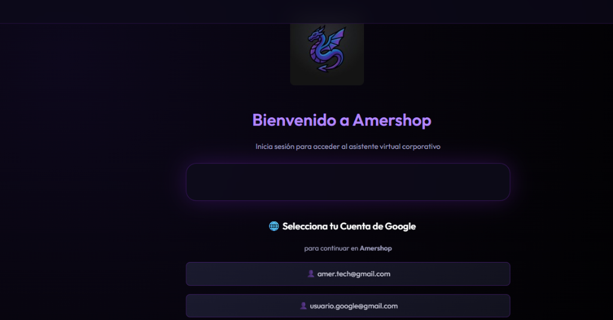
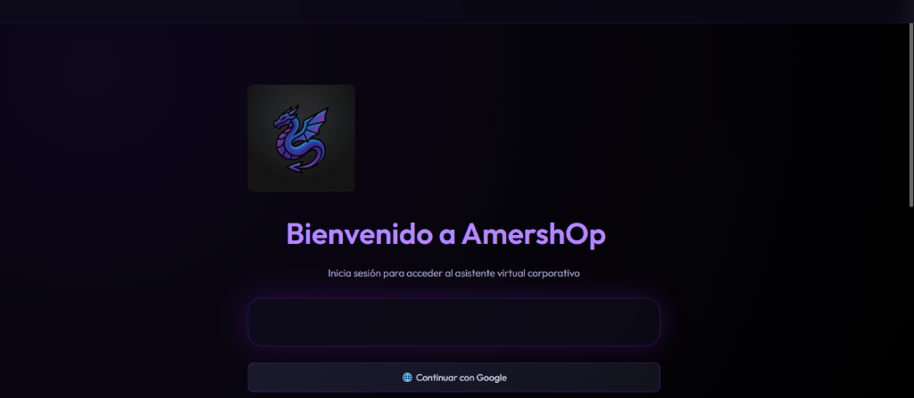
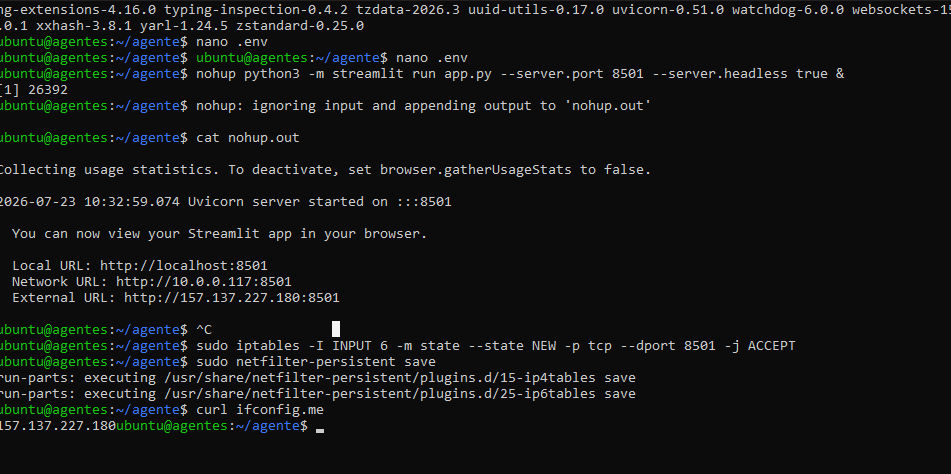
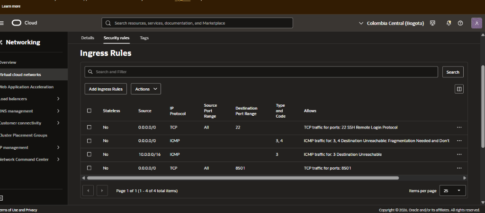

# 🛒 Amershop — Agente IA Corporativo

<div align="center">


**Asistente virtual inteligente de atención y consulta corporativa para la tienda de tecnología Amershop.**

</div>

---

## 📸 Capturas de Pantalla y Evidencia Visual

### 🔐 1. Pantalla de Inicio de Sesión y Autenticación
> *Interfaz Neón Glassmorphism con selección de cuenta y Google Identity Services (GIS):*



---

### 💬 2. Interfaz Principal de Chat y Cartel LED 24/7
> *Chat de respuestas RAG con indicador de estado animado en vivo:*



---

### ☁️ 3. Ejecución en Servidor Oracle Cloud (OCI)
> *Logs del proceso `nohup`, asignación de IP Pública y ejecución continua:*



---

### 🛡️ 4. Configuración de Reglas de Seguridad en OCI
> *Configuración de Ingress Rules para permitir tráfico en el puerto `8501`:*



---

## 📋 1. Descripción General del Proyecto

**Amershop IA** es una plataforma corporativa de asistencia inteligente basada en una arquitectura **RAG (Retrieval-Augmented Generation)**. Su propósito principal es brindar soporte instantáneo, preciso y fundamentado a colaboradores y clientes sobre las políticas internas, envíos, métodos de pago, devoluciones y catálogo de productos de la tienda online de tecnología Amershop.

### 🌟 Características Principales
- 🤖 **Respuesta en Lenguaje Natural:** Consultas fluidas potenciadas por el modelo **Groq (LLaMA 3.1 8B Instant)**.
- 📄 **Soporte Multiformato (8 tipos de archivos):** Procesa e indexa archivos PDF, DOCX, XLSX, PPTX, MD, CSV, JSON y HTML.
- 🔐 **Autenticación Flexible:**
  - **Google Identity Services (GIS):** Integración con el SDK oficial de inicio de sesión con Google.
  - **Acceso Corporativo:** Formulario con credenciales de usuario.
  - **Acceso Invitado:** Entrada directa para pruebas sin registro.
- 🚨 **Cartel LED 24/7 Animado:** Indicador visual en tiempo real de disponibilidad continua.
- 🎨 **Diseño Galaxia Glassmorphism:** Tema oscuro profesional con fondo espacial, bordes redondeados y efectos neón traslúcidos.
- 📌 **Citación Transparente de Fuentes:** Cada respuesta fundamentada indica los documentos de donde proviene la información.

---

## 🏗️ 2. Arquitectura de la Solución Implementada

La solución sigue un patrón RAG desacoplado de 3 capas: **Frontend**, **Agente RAG / Pipeline LLM** y **Vector Store / Ingesta de Documentos**.

```
┌─────────────────────────────────────────────────────────────┐
│                    CAPA DE PRESENTACIÓN                     │
│               Streamlit UI (Tema Glassmorphism)             │
│   ┌──────────────────┐ ┌──────────────────┐ ┌────────────┐   │
│   │ Login (GIS/User) │ │ Cartel LED 24/7  │ │ Chat Canvas│   │
│   └────────┬─────────┘ └──────────────────┘ └─────┬──────┘   │
└────────────┼──────────────────────────────────────┼─────────┘
             │                                      │
             ▼                                      ▼
┌─────────────────────────────────────────────────────────────┐
│                    CAPA DE LÓGICA / RAG                     │
│                 LangChain + Groq LLM Chain                  │
│   ┌─────────────────────────────────────────────────────┐   │
│   │ RAGAgent: Búsqueda MMR k=5 -> Document Grader      │   │
│   │ Prompt Template Estricto (Restricción USD + No invento)│  │
│   └──────────────────────────┬──────────────────────────┘   │
└──────────────────────────────┼──────────────────────────────┘
                               │
                               ▼
┌─────────────────────────────────────────────────────────────┐
│                 CAPA DE DATOS Y VECTORES                    │
│             VectorStoreManager (FAISS / Chroma)             │
│   ┌──────────────────────┐      ┌───────────────────────┐   │
│   │ Base Vectorial FAISS │      │ Loaders Multiformato  │   │
│   │ SentenceTransformers │      │ PDF, DOCX, XLSX, HTML │   │
│   └──────────────────────┘      └───────────────────────┘   │
└─────────────────────────────────────────────────────────────┘
```

---

## 🛠️ 3. Tecnologías y Herramientas Utilizadas

| Categoría | Tecnología / Herramienta | Propósito / Función |
| :--- | :--- | :--- |
| **Lenguaje Base** | Python 3.11+ | Entorno de desarrollo principal |
| **LLM Engine** | Groq (`llama-3.1-8b-instant`) | Generación rápida de respuestas |
| **Embeddings** | HuggingFace (`all-MiniLM-L6-v2`) | Conversión vectorial de texto |
| **Orquestación RAG** | LangChain Core & Groq Integration | Pipeline RAG, Prompts y Chains |
| **Vector DB** | FAISS / ChromaDB | Almacenamiento vectorial y búsqueda MMR |
| **Frontend Web** | Streamlit 1.35+ | Interfaz gráfica interactiva y reactiva |
| **Autenticación** | Google Identity Services (GIS) | SDK oficial de inicio de sesión con Google |
| **Despliegue Cloud** | Oracle Cloud Infrastructure (OCI) | VM Always Free Ubuntu 22.04 LTS |

---

## 🚀 4. Instrucciones para Ejecutar el Proyecto

### Opción A: Ejecución Local

1. **Clonar el repositorio:**
   ```bash
   git clone https://github.com/TU_USUARIO/agente.git
   cd agente
   ```

2. **Crear entorno virtual e instalar dependencias:**
   ```bash
   python -m venv venv
   # En Windows:
   .\venv\Scripts\activate
   # En Linux/macOS:
   source venv/bin/activate

   pip install -r requirements.txt
   ```

3. **Configurar el archivo de entorno (`.env`):**
   Crea un archivo `.env` en la raíz del proyecto basándote en `.env.example`:
   ```env
   GROQ_API_KEY=tu_api_key_de_groq_aqui
   GOOGLE_CLIENT_ID=tu_client_id_de_google_opcional
   ```

4. **Iniciar la aplicación:**
   ```bash
   streamlit run app.py
   ```
   Abre tu navegador en [http://localhost:8501](http://localhost:8501).

---

### Opción B: Despliegue en la Nube (Oracle Cloud OCI - Always Free)

1. **Crear VM en Oracle Cloud:**
   - Instancia: Ubuntu 22.04 LTS (Shape `VM.Standard.E2.1.Micro` o `A1.Flex`).
   - Abre el puerto `8501` en las reglas de entrada del VCN (Ingress Rules: TCP `8501`).

2. **Configurar el Servidor Linux (SSH):**
   ```bash
   sudo apt update && sudo apt install python3-pip git -y
   git clone https://github.com/TU_USUARIO/agente.git
   cd agente
   pip3 install -r requirements.txt
   nano .env # (Inserta tu GROQ_API_KEY)
   ```

3. **Habilitar el puerto en el firewall de Ubuntu y ejecutar:**
   ```bash
   sudo iptables -F
   sudo iptables -P INPUT ACCEPT
   nohup python3 -m streamlit run app.py --server.port 8501 --server.headless true &
   ```
   Accede desde tu navegador a `http://TU_IP_PUBLICA:8501`.

---

## ❓ 5. Ejemplos de Preguntas que el Agente Puede Responder

El agente está capacitado para responder preguntas sobre la tienda basadas en la base de conocimiento cargada en `documents/`:

1. **Preguntas sobre Envíos y Tiempos:**
   - *"¿Cuánto tarda en llegar un pedido con envío express?"*
   - *"¿Realizan envíos internacionales?"*
   - *"¿Cuáles son las tarifas de envío para pedidos menores a $50 USD?"*

2. **Preguntas sobre Políticas de Devolución y Garantía:**
   - *"¿Cuál es la política de devoluciones de la tienda?"*
   - *"¿Qué hago si mi producto llega dañado o defectuoso?"*
   - *"¿Cuántos días tengo para solicitar un reembolso?"*

3. **Preguntas sobre Métodos de Pago y Precios:**
   - *"¿Qué métodos de pago aceptan en Amershop?"*
   - *"¿Ofrecen pagos a meses sin intereses (MSI)?"*
   - *"¿En qué moneda están expresados todos los precios?"*

---

## 💬 6. Ejemplos de Respuestas Generadas por el Agente

### Ejemplo 1: Consulta sobre Envíos Express
> **Usuario:** *"¿Cuánto tarda el envío express y cuánto cuesta?"*
> 
> **Amershop IA:** 
> El envío express tarda de **1 a 2 días hábiles** en entregarse, dependiendo de tu código postal. 
> Tiene un costo de **$12 USD** para pedidos estándar o es **gratuito** en compras superiores a $150 USD.
> 
> *Fuentes: [guia_envios.html], [precios_envio.csv]*

---

### Ejemplo 2: Consulta sobre Políticas de Devolución
> **Usuario:** *"¿Puedo devolver una laptop si no me gustó y cuánto tiempo tengo?"*
> 
> **Amershop IA:** 
> Sí, dispones de **30 días naturales** a partir de la recepción de tu pedido para solicitar una devolución. 
> Ten en cuenta que si la devolución es por cambio de opinión (y no por fallo técnico), se descontará una tarifa fija de **$15 USD** del total a reembolsar por concepto de gastos de envío.
> 
> *Fuentes: [politica_reembolso.docx], [faq.md]*

---

### Ejemplo 3: Manejo de Preguntas Fuera de Dominio
> **Usuario:** *"¿Quién ganó el último mundial de fútbol?"*
> 
> **Amershop IA:** 
> No encontré información sobre este tema en los documentos disponibles. Te sugiero consultar con el área correspondiente.

---

## 🛡️ Licencia y Créditos
Desarrollado para **Amershop** — Plataforma Corporativa de IA. Todos los derechos reservados.
